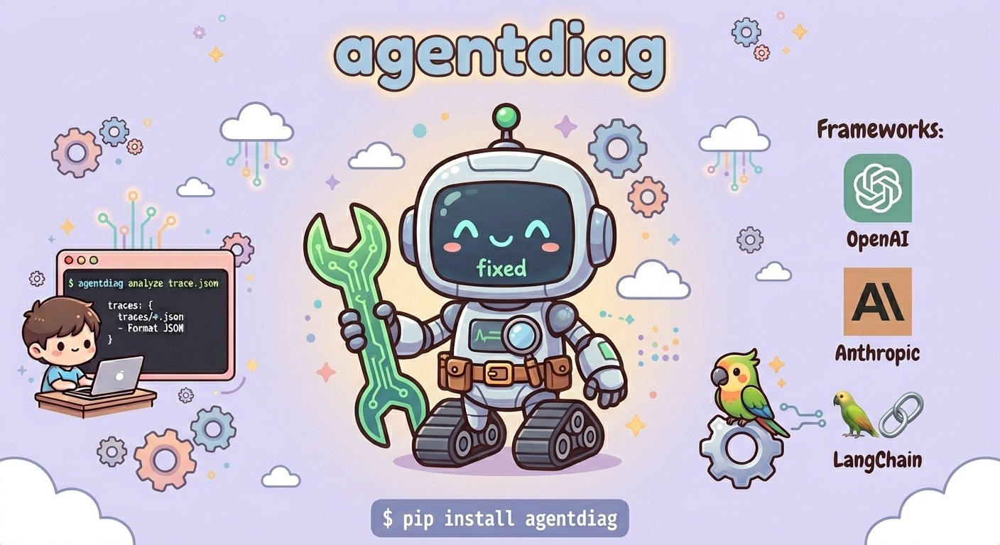

<p align="center">
  
</p>

# agentdiag

Diagnose why AI agents fail. Lightweight CLI and Python SDK for agent trace analysis.

**Links:**
[Overview](#overview) | [Install](#install) | [CLI Usage](#cli-usage) | [SDK Usage](#sdk-usage) | [Detectors](#detectors) | [Project Structure](#project-structure)

## Overview

agentdiag is a framework-agnostic diagnostic tool for AI agents. Feed it a trace — from the CLI or auto-captured via the SDK — and it tells you **what went wrong and how to fix it**.

Most existing tools are either research artifacts you can't `pip install`, locked to one framework, or full observability platforms that require accounts and dashboards. agentdiag is none of those:

- **Zero config** — `pip install agentdiag` and go
- **Framework-agnostic** — works with OpenAI, Anthropic, LangChain, or raw JSON
- **Actionable** — doesn't just say "failure at step 5", says _why_ and _what to change_
- **Two interfaces** — CLI for trace files, Python SDK for live instrumentation

```
+----------------------------- AgentDiag Report ------------------------------+
| Task:    Find the cheapest flight from NYC to LAX on December 15            |
| Model:   gpt-4o                                                             |
| Steps:   10                                                                 |
| Outcome: FAILURE                                                            |
+-----------------------------------------------------------------------------+
                                   Findings
+-----------------------------------------------------------------------------+
| Severity | Detector             | Steps    | Summary                        |
|----------+----------------------+----------+--------------------------------|
| HIGH     | LOOP                 | 1-7      | Agent repeated 'search_flights'|
|          |                      |          | 4 times with identical args.   |
| HIGH     | RECOVERY_FAILURE     | 1-3      | Agent retried with identical   |
|          |                      |          | arguments after an error.      |
+-----------------------------------------------------------------------------+
+---------------------------------- Metrics ----------------------------------+
| Recovery Rate: 0%  |  Tool Accuracy: 100%  |  Loops: 1  |  Findings: 5      |
+-----------------------------------------------------------------------------+
```

## Install

```bash
pip install agentdiag
```

## CLI Usage

Analyze trace files directly from the terminal:

```bash
# Analyze a single trace
agentdiag analyze trace.json

# Analyze multiple traces
agentdiag analyze traces/*.json

# JSON output (for CI/CD pipelines)
agentdiag analyze trace.json --format json
```

agentdiag auto-detects the trace format — it supports its own raw JSON format, LangChain/LangSmith exports, and OpenAI Agents SDK traces.

### Raw Trace Format

```json
{
  "task": "What the agent was trying to do",
  "steps": [
    { "index": 0, "type": "thought", "content": "Agent's reasoning" },
    {
      "index": 1,
      "type": "tool_call",
      "content": "Calling search",
      "tool_name": "search",
      "tool_args": { "q": "test" }
    },
    {
      "index": 2,
      "type": "observation",
      "content": "Search returned 3 results"
    },
    { "index": 3, "type": "result", "content": "Here are the results..." }
  ],
  "outcome": "success",
  "model": "gpt-4o",
  "available_tools": ["search", "write_file"]
}
```

## SDK Usage

### Auto-Instrumentation (recommended)

Wrap your OpenAI or Anthropic client in one line. Everything is captured automatically — no manual logging needed.

**OpenAI:**

```python
from openai import OpenAI
from agentdiag import watch_openai

client = OpenAI()
client, tracer = watch_openai(client, task="Book a flight NYC to LAX")

# Use client normally — all calls are auto-traced
response = client.chat.completions.create(
    model="gpt-4o",
    messages=[{"role": "user", "content": "Book a flight NYC to LAX"}],
    tools=[...],
)

# Run diagnostics
tracer.set_outcome("success")
tracer.diagnose()
```

**Anthropic:**

```python
from anthropic import Anthropic
from agentdiag import watch_anthropic

client = Anthropic()
client, tracer = watch_anthropic(client, task="Summarize my emails")

response = client.messages.create(
    model="claude-sonnet-4-20250514",
    messages=[...],
    tools=[...],
)

tracer.diagnose()
```

The wrapper auto-captures:

- Model name and available tools from API parameters
- Agent reasoning (thoughts) from response content
- Tool calls with names and arguments
- Tool results from follow-up messages
- Final answers

### Manual Tracer

For custom frameworks or when you need full control:

```python
from agentdiag import Tracer

tracer = Tracer(
    task="Send a Slack message",
    model="gpt-4o",
    available_tools=["send_slack_message", "list_channels"],
)

tracer.thought("I need to send a message to #general")
tracer.tool_call("send_slack_message", args={"channel": "#general", "text": "hello"})
tracer.observation("Message sent successfully")
tracer.result("Done — message sent to #general")
tracer.set_outcome("success")

report = tracer.diagnose()

# Save trace for later analysis
tracer.save("trace.json")
```

## Detectors

agentdiag runs 5 failure detectors against every trace:

| Detector                 | What it catches                                                                      |
| ------------------------ | ------------------------------------------------------------------------------------ |
| **LOOP**                 | Agent repeats the same tool call 3+ times with identical or near-identical arguments |
| **TOOL_MISUSE**          | Agent calls a tool that isn't in the available tools list                            |
| **RECOVERY_FAILURE**     | Agent encounters an error and retries with the exact same approach                   |
| **PREMATURE_STOP**       | Agent gives up before completing the task without exhausting alternatives            |
| **HALLUCINATED_SUCCESS** | Agent claims the task is done but the outcome is failure                             |

Each finding includes a severity level (high/medium/low), the affected step range, a human-readable summary, and an actionable suggestion.

## Metrics

Every report includes computed metrics:

- **Recovery Rate** — errors followed by a strategy change / total errors
- **Tool Accuracy** — valid tool calls / total tool calls
- **Loop Count** — number of detected loops
- **Failure Density** — findings per step

## Supported Trace Formats

| Format                | Auto-detected | Notes                                                          |
| --------------------- | ------------- | -------------------------------------------------------------- |
| agentdiag raw JSON    | Yes           | Native format with `task` and `steps` fields                   |
| LangChain / LangSmith | Yes           | Exported traces with `runs` array                              |
| OpenAI Agents SDK     | Yes           | Traces with `model_response`, `tool_call`, `tool_output` steps |

## Project Structure

```
src/agentdiag/
├── cli.py              # CLI entry point (agentdiag analyze)
├── schema.py           # Pydantic models (Step, Trace, Finding)
├── tracer.py           # Manual Tracer SDK
├── metrics.py          # Aggregate metric computation
├── report.py           # Rich terminal + JSON output rendering
├── adapters/           # Convert framework traces to universal format
│   ├── raw.py          # Native JSON format
│   ├── langchain.py    # LangChain/LangSmith traces
│   └── openai_sdk.py   # OpenAI Agents SDK traces
├── detectors/          # Failure pattern detectors
│   ├── loop.py         # Repeated identical tool calls
│   ├── tool_misuse.py  # Calls to nonexistent tools
│   ├── recovery.py     # Failure to adapt after errors
│   ├── premature_stop.py  # Giving up too early
│   └── hallucination.py   # Claiming false success
└── instrument/         # Auto-instrumentation wrappers
    ├── openai.py       # OpenAI client wrapper
    └── anthropic.py    # Anthropic client wrapper
```

## Development

```bash
git clone https://github.com/JulianTang2027/agentdiag.git
cd agentdiag
python -m venv .venv
.venv\Scripts\activate        # Windows
# source .venv/bin/activate   # macOS/Linux
pip install -e ".[dev]"
pytest tests/ -v
```

## Contributing

Contributions are welcome! If you find bugs, have feature requests, or want to add new detectors/adapters, please open an issue or submit a pull request.

Some ideas for contributions:

- New detectors (e.g., plan drift, cost analysis, latency outliers)
- New adapters (e.g., CrewAI, AutoGen, custom frameworks)
- CI/CD integrations (GitHub Actions, etc.)
- More metrics and report formats

```bash
# Fork the repo, then:
git clone https://github.com/YOUR_USERNAME/agentdiag.git
cd agentdiag
pip install -e ".[dev]"
pytest tests/ -v        # Make sure tests pass before submitting
```

## Authors

Built by [Julian Tang](https://github.com/JulianTang2027) with the help of [Claude Code](https://claude.ai/claude-code). Mascot by Gemini Nano Banana.

## License

MIT
